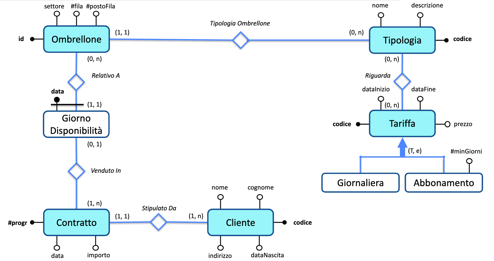
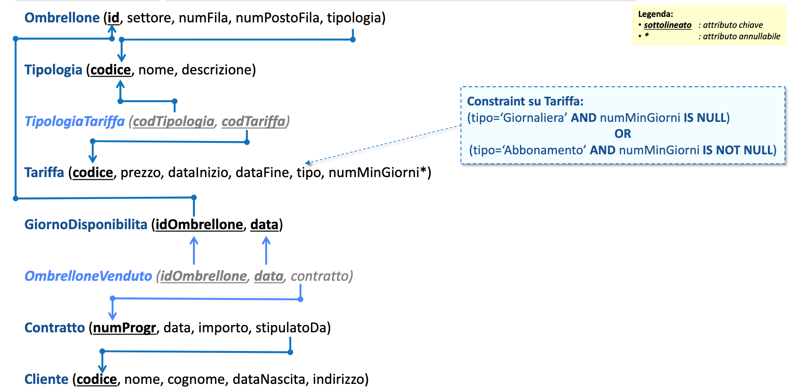
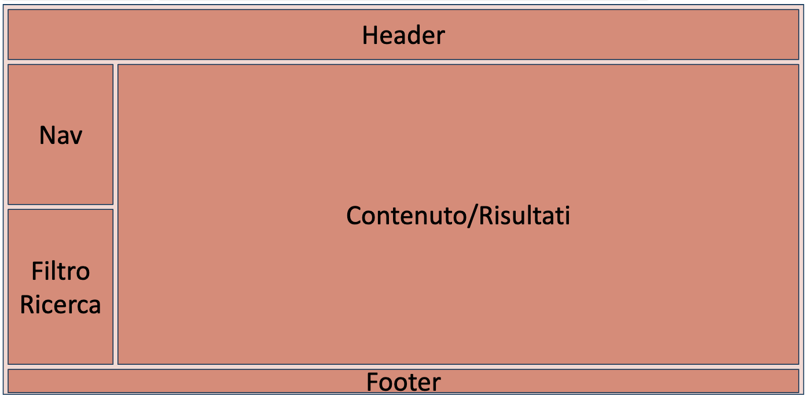

# Progetto Programmazione Web

Il progetto di programmazione web chiede di disegnare una applicazione web in grado di gestire le prenotazioni di un noleggio ombrelloni.
La consegna prevede di:
- Generare il database con una decente quantità di dati, ~50/100k righe per tabella.
- Creare un'interfaccia grafica seguendo un preciso layout e un colore dominante
- La pagina web deve essere dinamica e fare query al database

## Gestione del progetto

Per mantenere una certa organizzazione useremo la kanban di github per essere in grado di dividerci il lavoro in modo equo. Ogni menbro dovrà segnalare problemi e aggiornare lo stato del lavoro.

Il database e il sito deve essere hostato su altervista per semplicità.
- User: 
- Password: 

## Generazione dei dati di test

La generazione dei dati di test la faremo utilizzando **Faker-js** una libreria che permette di descrivere i tipi di darti che serve generare e i vincoli, per poi creare un database completo con un arbitrario numero di righe e colonne. Per eseguire il file della generazione bisognerà utilizzare **Node JS**, quindi il file sarà in javascript.

La documentazione della libreria è disponibile qui: https://fakerjs.dev/guide/.

Il database da generare è descritto dalla seguente consegna e diagrammi:

***Base di dati per la gestione del noleggio degli ombrelloni in una spiaggia attrezzata in cui si ha la necessità di gestire l’affitto degli ombrelloni ai clienti, in base al tipo di ombrellone e al periodo.** Ogni ombrellone è identificato da un identificatore numerico, ed è caratterizzato dal settore della spiaggia, dal numero di fila e dal numero d’ordine all’interno della fila. Gli ombrelloni sono associati ad una tipologia, dove ogni tipologia è identificata da un codice ed è caratterizzata da un nome e dalla descrizione (testuale) degli accessori in dotazione agli ombrelloni di quella tipologia (per esempio, sdraio, lettino, ecc.). Per ogni tipologia, si ha un insieme di tariffe associate: le tariffe indicano quale prezzo applicare a seconda del periodo e del tipo di affitto che viene scelto dal cliente. Pertanto, una tariffa è identificata da un codice ed è caratterizzata dal periodo di validità della tariffa, nonché dal prezzo; inoltre, le tariffe vengono suddivise in giornaliere (che valgono per un affitto di un solo giorno) o in abbonamento e per queste ultime si vuole sapere il numero minimo di giorni per far decorrere l’abbonamento. Per poter affittare gli ombrelloni senza correre il rischio di affittare lo stesso ombrellone a due clienti contemporaneamente, occorre predisporre, per ciascun ombrellone, un insieme di giorni di disponibilità: ogni giorno di disponibilità è identificato univocamente dalla data rispetto all’ombrellone di riferimento (ovviamente, possono esserci giorni di disponibilità con la stessa data ma per ombrelloni diversi). Per finire, l’ufficio vendite effettua un contratto di affitto con un cliente; il contratto è identificato da un numero progressivo ed è caratterizzato dalla data, dall’importo complessivo e dai giorni di disponibilità degli ombrelloni affittati con quel contratto (ad un giorno di disponibilità può essere associato al più un contratto).* 

**Diagramma ER**

**Schema logico**

## Interfaccia grafica

L'interfaccia grafica è definita a grandi linee dalla seguente immagine:

È possibile modificarla leggermente a fronte dei tipi di dati che necessariamente andranno visualizzati. Ogni parte della finestra deve essere pensato per rispondere a ogni variazione riguardante le dimensioni della finestra e la quantità di dati presenti all'interno.

La palette di colori è stata decisa dal professore e sarà di colore 
**Giallo**

## Query al database

Bisogna supportare le basilari operazioni CRUD
- Create
- Read
- Update
- Delete